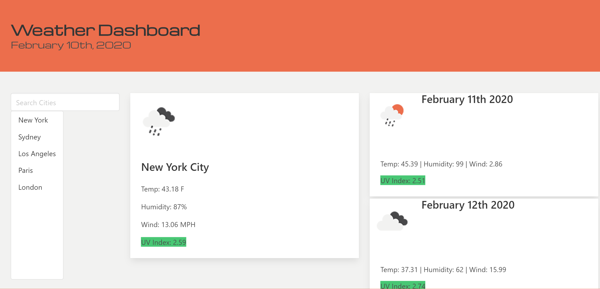

# Weather-Dashboard

## Who made this project?

I did!

## What is this project for?

This is a weather dashboard that will let you search a city and get the current weather and a five day forecast. The page will default to San Diego, CA.
Any searches will be saved in local storage and clicking on an old search will bring show the weather for that city.

## Why did I make this project?

This project was created to practice using third-party API's in web applications.

### Guide

Type in the name of a city and press enter to see current and future weather.